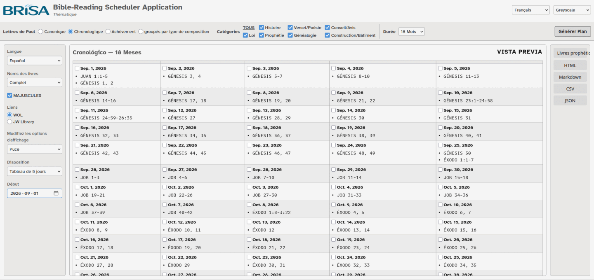

#  Bible-Reading Scheduler Application
###### *Gentle and constant.*

**A single-file web application for generating customized Bible-reading schedules with progress tracking and print-friendly output. Works entirely offline in any modern browser — no server required.**

Preview…
 

 

Features…
 

### Reading Plans

- **Orderings**: Choose from Canonical (Bible order), Chronological (historical order)[^1], or Completion (by date of completion).
- **Selection**: Choose your reading scope by Categories (filter by verse type) or Thematic (predefined book collections).
  - **Thematic groups**: Predefined book collections including Historical Books, Gospels and Acts, Poetic Writings, Major and Minor Prophets, Paul's Letters, etc.  Also includes the special 10-day Memorial Reading plan.
  - **Categories**: Filter by verse type including History, Verse/Poetry, Counsel/Advice, Prophecy, Law, Building/Construction and Genealogy[^1].
- **Duration**: Available durations adapt to the size of the selected content, ranging from 1 month to 48 months. The dropdown shows estimated verses per day[^2] to help choose a manageable pace.

### Display Options

- **Language**: Select the language for scripture references.
- **Book name format**: Full names, standard abbreviations, or official abbreviations. Optional ALL CAPS toggle.
- **Scripture indent**: None, padding, or bullet markers for scripture references in the generated plan.
- **Layout**: Outline view or table views with 3, 5, 7 (one week), or 10 day columns.
- **Start date**: Set a commencement date for the plan. Day labels show dates instead of day numbers when set.
- **Links**: Choose between *WOL* (*Watchtower Online Library*)[^3] links or *JW Library*[^4] deep links. Scripture references become clickable links. Day/Date is linked to *WOL* for all segments combined.
- **Preview**: Shows a preview of the generated plan. Checkbox status *is not retained* in the preview.
- **Flexible starting point**: Click the ▶ button for any day to rotate the schedule so that day becomes first. The plan wraps around from the end to the beginning. Regenerate or click the first day's ▶ to reset.

### Pop-out

- Opens the generated plan as a standalone HTML document.
- Checkboxes for tracking daily reading progress.
- Save button downloads the plan with progress embedded, allowing the user to replace their previous copy.
- Clear button resets all checkbox progress.
- Auto-scrolls to the last checked day when reopened.
- Print-friendly: checkboxes and links render cleanly when printed.

### Exports

- **JWPUB**: Package for installation in *JW Library*[^4]. Please note:
  - This **requires network access** to upload the generated plan **to my server** for conversion; the JWPUB file is downloaded automatically.
  - The generated JWPUB archive is not signed ("official"); to add it to *JW Library*, you will need to use the [*jwlIntegrator* utility](https://github.com/erykjj/jwlIntegrator).
- **Markdown**: Plan with checkbox list format, including clickable links for each scripture reference.
- **CSV**: Spreadsheet-compatible format with the selected layout.
- **JSON**: Minimal format containing day number, label, and scripture references.

### Multi-language Support

Available languages include ASL (English text with sign language links), English, Español, Français, Português, Русский, and українська. The UI language controls the application interface, while the display language controls book names and plan content.

### Themes

Thirteen built-in themes.

### Configuration Sharing

The current configuration is encoded into the URL query parameter. Bookmark the page or copy the URL to save and share a specific plan setup. Opening the URL restores all settings including language, theme, ordering, and duration.

 

**Download**: [BRiSA.html](https://github.com/erykjj/BRiSA/releases/latest/download/BRiSA.html)

**Launch directly**: [BRiSA](https://erykjj.github.io/BRiSA/BRiSA.html) *(use `Ctrl+Click` or middle-click for a new tab)*

____
### Feedback, etc.

Feel free to get in touch and post any [issues and/or suggestions](https://github.com/erykjj/BRiSA/issues).

____
#### Footnotes:
[^1]: Chronologial ordering and category assignments will be fine-tuned over time.

[^2]: These are only averages, since the generator favors chapter breaks over exact number of verses.

[^3]: [*Watchtower Online Library*](https://wol.jw.org/) is a registered trademark of *Watch Tower Bible and Tract Society of Pennsylvania*.

[^4]: [*JW Library*](https://www.jw.org/en/online-help/jw-library/) is a registered trademark of *Watch Tower Bible and Tract Society of Pennsylvania*.